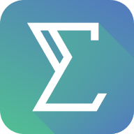

# SIGMA v2.0.0 - Academic Intelligence Platform



SIGMA v2.0.0 is an enterprise-grade, high-performance School Information Management System designed for modern Islamic Boarding Schools (*Pesantren*) and Academic Institutions. It represents a fully modular and high-concurrency architecture, transitioning from a legacy monolithic stack to a Go-Vue "Thin UI" paradigm.

## System Architecture

The ecosystem operates on a decoupled client-server model:

1. **Backend (sigma-api)**: Built using Go (Fiber v3). It acts as a Modular Monolith API provider tailored for cross-domain orchestration, using a Zero-Allocation strategy where possible. Data persistence is engineered using high-speed SQLite in WAL mode.
2. **Frontend (sigma-web)**: An administrative web application ("Backoffice") using Vue 3 (Composition API), Vite, Tailwind CSS v4, and Lucide Icons. Features an aesthetically premium "Thin UI", abstracting logic away to the Go backend.
3. **Portal (sigmagate-web)**: A dedicated public-facing or parent gateway portal.

## Technology Stack

### Backend (`/sigma-api`)
- **Language**: Go (1.20+)
- **Framework**: Fiber v3
- **ORM**: GORM (with sqlite driver by `glebarez/sqlite`)
- **Database**: SQLite (Write-Ahead Logging mode configured for lock-safety)
- **Security**: JWT-based Authentication

### Frontend (`/sigma-web`)
- **Framework**: Vue 3 + TypeScript
- **Bundler**: Vite
- **Styling**: Tailwind CSS v4
- **Tools**: Axios, jsPDF, XLSX (SheetJS), AutoTable

## Core Modules

SIGMA is composed of 8 primary domain modules seamlessly integrated:
- **Sigmabase**: Academic mastery, student crud, alumni mapping, and instructor tracking.
- **Sigmaflow**: Automated graduation workflows and academic transitioning.
- **Sigmadesk**: Bureaucratic administration and internal file orchestration.
- **Sigmaguard**: Permission systems, attendance, and disciplinary (violation) reporting.
- **Sigmaedu**: Assessment tracking, exam schedules, and curriculum mapping.
- **Sigmacare**: Healthcare and internal clinic reports for students.
- **Sigmalit**: Invoicing, payment gateways, and transparent tuition management.
- **Settings/Auth**: Gatekeeper services defining security layers.

## Installation & Setup

### 1. Backend (`sigma-api`)
```bash
cd sigma-api
go mod tidy
# Start the Fiber server (Default: Port 3000)
go run cmd/api/main.go
```
*Note: Make sure `.env` variables or OS environment variables are properly mapped. The database auto-migrates upon boot.*

### 2. Frontend Admin (`sigma-web`)
```bash
cd sigma-web
npm install
# Start Vite development server
npm run dev
```

### 3. Database Management 
SIGMA uses high-speed SQLite. The primary database is generated automatically at `sigma-api/data/sigma.db` during backend initialization.

## Version Control

This repository serves as the single source of truth for the v2.0.0 migration phase. For contributions, ensure cross-platform compatibility and stick strictly to the established *Component Styling Base* inside `sigma-web`.

---

© 2026 Celcious Cyber Intelligence. All Rights Reserved.
